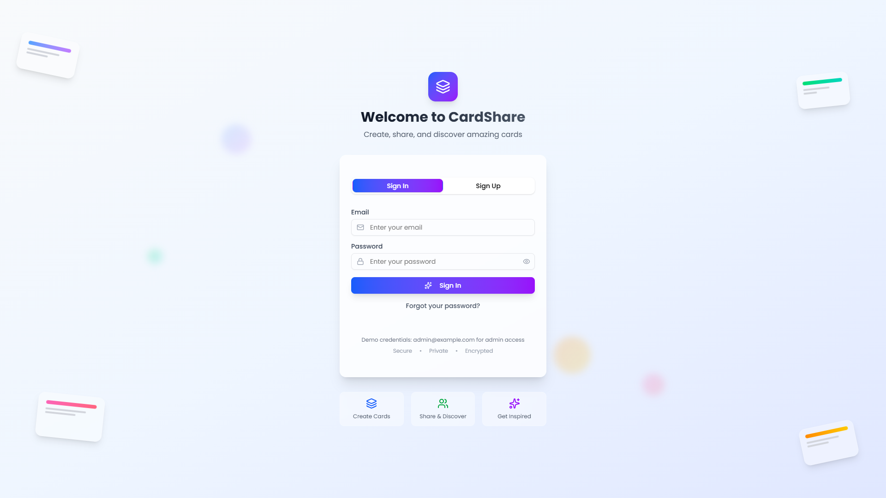
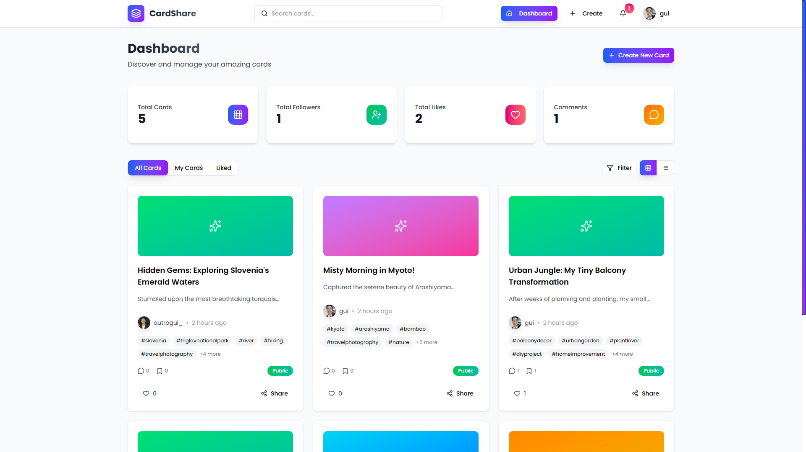
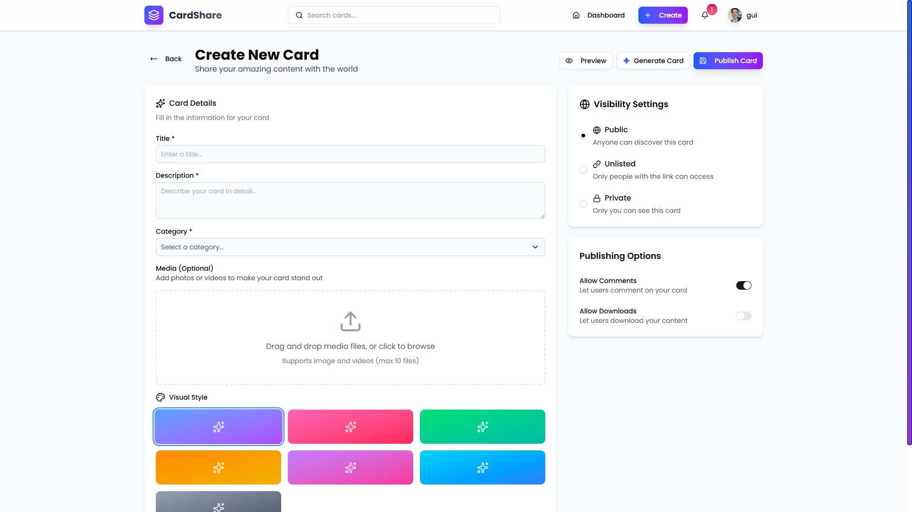
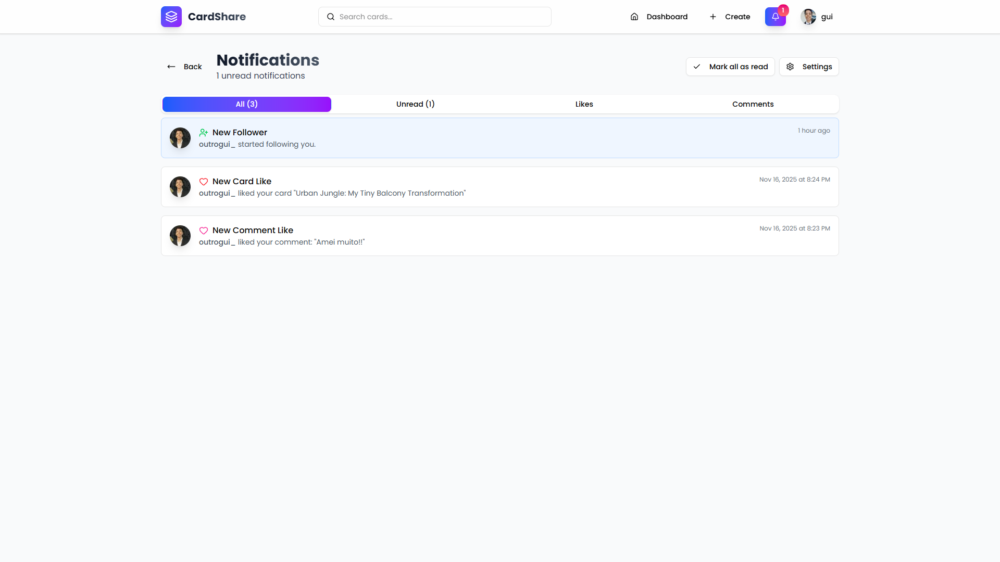
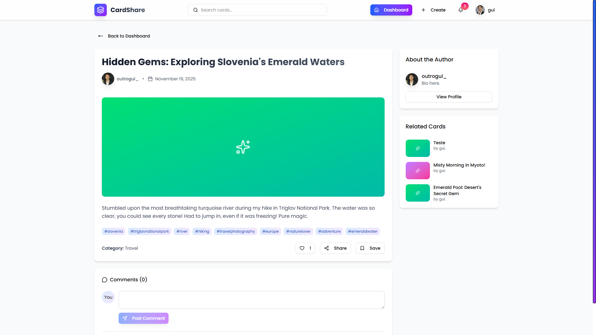
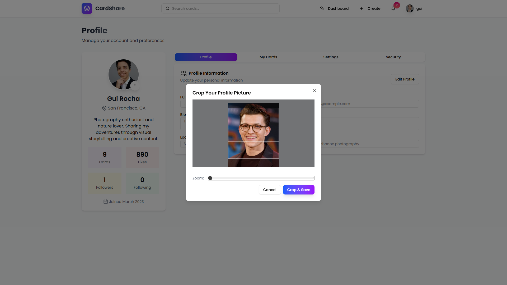
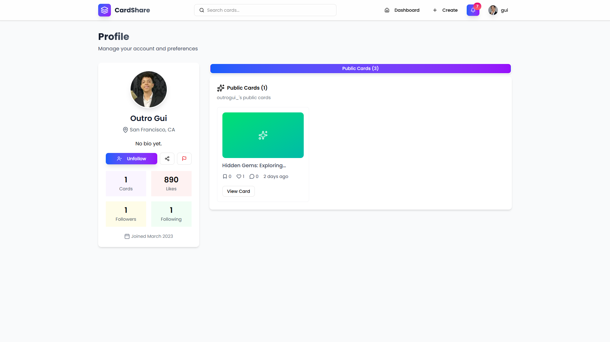
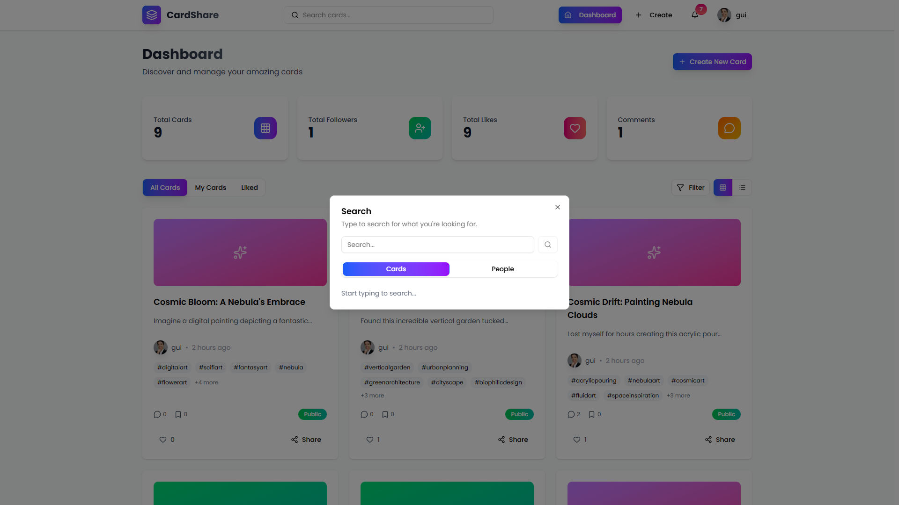

# CardShare

CardShare is a modern and user-friendly platform for sharing and discovering creative cards. Whether you're an artist, designer, or just someone who loves sharing ideas, CardShare makes it easy to create, edit, and explore cards while connecting with others.

---

## Features

### Authentication

- **Sign Up & Sign In**: Create an account or log in to access all features.
- **Email Confirmation**: Secure your account with email verification.

### Card Management

- **Create Cards**: Add titles, descriptions, media, tags, and more. Customize visibility, allow comments, and even use the **Generate** button powered by Gemini 2.5 Flash to pre-fill your card with creative ideas.
- **Edit & Delete Cards**: Update or remove your cards anytime.
- **Dynamic Listing**: Browse cards with infinite scrolling, powered by the Intersection Observer API.

### Homepage

- **Filters**: Easily switch between "All Cards," "My Cards," and "Liked Cards."
- **Sort Options**: Filter by "Recent" or "Most Liked."
- **View Modes**: Toggle between grid view and row-by-row view.

### Card Details

- **Related Cards**: Discover similar cards to the one you're viewing.
- **Comments**: Add comments, like comments, and engage with the community.
- **Share**: Use the **Navigator.share** API to share cards seamlessly.

### User Features

- **Search**: Find cards and users with a powerful search feature.
- **Follow/Unfollow**: Connect with other users by following or unfollowing them.
- **Profile Picture**: Upload, crop, and zoom your profile picture before saving.

### Notifications

- **Real-Time Notifications**: Stay updated with WebSocket-powered notifications.
- **Notification Sounds**: Enjoy audio alerts using the Audio API for new notifications.

### Responsive Design

- Fully optimized for all devices, ensuring a seamless experience on mobile, tablet, and desktop.

---

## Technology

CardShare is built with cutting-edge technologies to deliver a fast, secure, and scalable experience.

- **Next.js**: For server-side rendering and optimized performance.
- **React**: For building dynamic and interactive user interfaces.
- **TypeScript**: For type safety and better developer experience.
- **Tailwind CSS**: For modern and responsive styling.
- **React TanStack Query**: For efficient data fetching, caching, and state management.
- **WebSockets**: For real-time notifications.
- **Intersection Observer API**: For infinite scrolling.
- **Audio API**: For notification sounds.

---

## Getting Started

### Prerequisites

- Node.js
- npm or yarn

### Installation

1. Clone the repository:
   ```bash
   git clone https://github.com/guilhermescr/cardshare-ui.git
   ```
2. Navigate to the project directory:
   ```bash
   cd cardshare-ui
   ```
3. Install dependencies:
   ```bash
   npm install
   ```
4. Start the development server:
   ```bash
   npm run dev
   ```

---

## Screenshots

### Homepage



### Card Creation



### Notifications



### Card Details



### Crop and Save Profile Picture



### Profile Page



### Search Cards & Users



---

## Links

- **Live Demo**: [https://cardshare-app.vercel.app/](https://cardshare-app.vercel.app/)
- **Repository**: [https://github.com/guilhermescr/cardshare-ui](https://github.com/guilhermescr/cardshare-ui)

---

## Reporting Issues

If you encounter any critical bugs or security vulnerabilities, please contact me directly at **devguiga@gmail.com**. Your feedback is highly appreciated and helps improve the platform!

---

## Authors

- **Guilherme Rocha**  
  Follow me on [GitHub](https://github.com/guilhermescr) and join the community!  
  Thank you for visiting, and happy card sharing!
